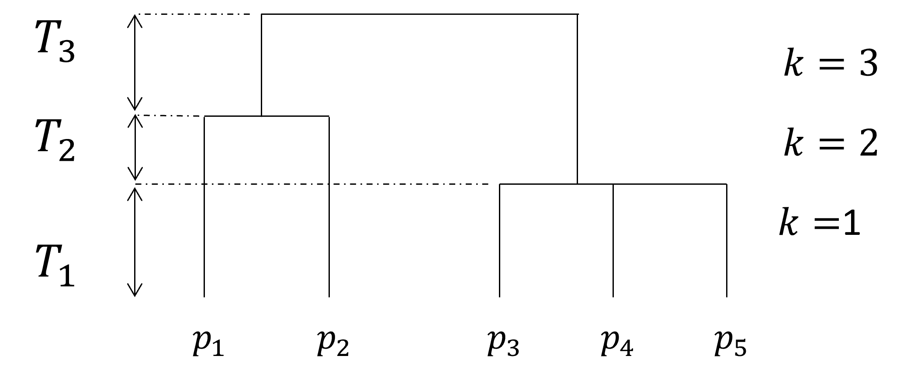

```{r}
#| label: DoNotModify
#| include: false
### Utilities. Do not modify.
# Installation of packages if necessary
install_packages <- function(packages) {
  install_package <- function(package) {
    if (!package %in% installed.packages()[, 1]) {
      install.packages(package, repos = "https://cran.rstudio.com/")
    }
  }
  invisible(sapply(packages, install_package))
}

# Basic packages
install_packages(c("bookdown", "formatR", "kableExtra", "ragg"))

# Chunk font size hook: allows size='small' or any valid Latex font size in chunk options
def.chunk.hook  <- knitr::knit_hooks$get("chunk")
knitr::knit_hooks$set(chunk = function(x, options) {
  x <- def.chunk.hook(x, options)
  ifelse(
    options$size != "normalsize", 
    paste0("\n \\", options$size,"\n\n", x, "\n\n \\normalsize"),
    x
  )
})
```

```{r}
#| label: Options
#| include: false
### Customized options for this document
# Add necessary packages here
packages <- c("tidyverse", "divent", "vegan", "entropart")
# Install them
install_packages(packages)

# knitr options
knitr::opts_chunk$set(
  cache =   TRUE,    # Cache chunk results
  include = TRUE,    # Show/Hide chunks
  echo =    FALSE,   # Show/Hide code
  warning = FALSE,   # Show/Hide warnings
  message = FALSE,   # Show/Hide messages
  # Figure alignment and size
  fig.align = 'center', out.width = '90%',
  # Graphic devices (ragg_png is better than standard png)
  dev = c("ragg_png", "pdf"),
  # Code chunk format
  tidy = FALSE, tidy.opts = list(blank = FALSE, width.cutoff = 50),
  size = "scriptsize", knitr.graphics.auto_pdf = TRUE
)
options(width = 50)

# ggplot style
library("tidyverse")
theme_set(theme_bw())
theme_update(
  panel.background = element_rect(fill = "transparent", colour = NA),
  plot.background = element_rect(fill = "transparent", colour = NA),
  text = element_text(size = 24)
)
knitr::opts_chunk$set(dev.args = list(bg = "transparent"))

# Tibbles: 5 lines, fit to slide width
options(tibble.print_min = 5, tibble.width = 50)

# Random seed
set.seed(973)
```

# Théorie

## Entropie

Expérience à plusieurs résultats possibles : espèce à laquelle appartient un individu : $\{r_1, r_2, \dots, r_s, \dots, r_S\}$

Probabilités associées $\{p_1, p_2, \dots, p_s, \dots, p_S\}$

Information $I(p_s)$, décroissante, $I(1) = 0$

Entropie = Information moyenne apportée par un individu: $\sum_s{p_s I(p_s)}$

## Exemples

Le fondateur : @Shannon1948

-   $I(p_s) = \ln{\frac{1}{p_s}}$
-   $H = \sum_s{p_s \ln{\frac{1}{p_s}}}$

Les généralisations :

-   @Renyi1961 :

    -   $^{\alpha}R = \frac{1}{1 - \alpha} \ln{\sum_s{p_s^\alpha}}$

-   @Tsallis1998a :

    -   $^{q}H = \frac{1}{q - 1} (1 - \sum_s{p_s^q})$.
    -   Appelée aussi HCDT [@Havrda1967; @Daroczy1970; @Tsallis1998a]

## Axiomatique

Les trois entropies respectent [@Patil1982; @Grabchak2016] :

-   Symétrie
-   Continuité par rapport aux probabilités
-   Principe des transferts, qui contient:
    -   L'ajout d'une espèce augmente la diversité
    -   Maximisation si toutes les probabilités sont égales

## Propriétés

$^{0}H$ est le nombre d'espèces -1

$^{1}H$ est l'entropie de Shannon

$^{2}H$ est l'entropie de Simpson : $1 - \sum_s{p_s^2}$

$q$ paramétrise l'importance des espèces rares.

Application à la relation diversité-productivité en forêt @Liang2016 : $q = 2$.

## Logarithmes déformés

@Tsallis1994:

-   $\ln_q{x} = \frac{x^{1-q} - 1}{1 - q}$

-   $e_q^x = \left[1 + \left(1 - q \right)x \right]^{\frac{1}{q - 1}}$

Simplifie l'écriture de l'entropie HCDT [@Marcon2014a] :

$^{q}H = \sum_s{p_s \ln_q{\frac{1}{p_s}}}$

## Logarithmes déformés {.flexbox .vcenter}

```{r}
I0 <- function(p) (1 - p)/p
I1 <- function(p) -log(p)
I2 <- function(p) 1 - p
ggplot(
  data.frame(x = c(0, 1)), 
  aes(x)
) + 
  stat_function(fun = I0) +
  stat_function(fun = I1, lty = 2) + 
  stat_function(fun = I2, lty = 3) + 
  coord_cartesian(ylim = c(0, 10)) + 
  labs(x = "p", y = "I(p)")
```

## Résumé / Définitions

La rareté est l'inverse de la probabilité : $\frac{1}{p_s}$

L'information est le logarithme (déformé) de la rareté : $\ln_q{\frac{1}{p_s}}$

L'entropie est l'espérance de l'information :

$$^{q}H = \sum_s{p_s \ln_q{\frac{1}{p_s}}}$$

## Nombres de Hill

@Hill1973 : Nombre d'espèces équiprobables ayant l'entropie des données.
Nombre effectif [@Wright1931 ; @Gregorius1991].

Résume la diversité à un seul nombre : diversité au sens strict [@Jost2006]

La diversité est l'exponentielle de l'entropie [@Marcon2014a] :

$$^{q}D = e_q^{^{q}H}$$

# Pratique

## Barro Colorado Island {.flexbox .vcenter}

Diagramme rang-abondance [@Whittaker1965]

```{r}
#| echo: false
library("vegan")
data(BCI)
BCI %>% 
  # Sum all plots
  colSums() -> BCI_50ha
library("divent")
BCI_50ha %>% 
  as_abundances() %>% 
  autoplot()
```

## Courbe d'accumulation {.flexbox .vcenter}

Diversité de l'échantillon, asymptotique ou standardisée

```{r}
#| label: BCI_accum
BCI_S_estimate <- div_richness(BCI_50ha, as_numeric = TRUE)
BCI_density <- round(sum(BCI) / 50)
BCI_S_1ha <- round(
  div_richness(
    BCI_50ha, 
    level = BCI_density, 
    as_numeric = TRUE
  )
)
BCI_50ha %>%
  # Declare the object class (divent)
  as_abundances() %>% 
  # Site name
  mutate(site = "BCI") %>% 
  # Accumulation curve up to 2x sample size
  accum_hill(levels = seq_len(2 * sum(BCI_50ha))) %>% 
  # Plot
  autoplot() +
  # Asymptotic estimator
  geom_hline(
    yintercept = c(BCI_S_estimate, BCI_S_1ha),
    linetype = c(2, 3)
  ) +
  geom_vline(
    xintercept = BCI_density, 
    linetype = 3
  ) +
  theme(legend.position = "none") +
  labs(y = "Diversity")
```

## Diversité aymptotique

Il existe des estimateurs :

-   Richesse : Chao [@Chao1984] ou Jacknife [@Burnham1978]

```{r}
#| echo: true
#| df_print: kable
library("divent")
div_richness(BCI_50ha)
```

-   Entropie HCDT :
    -   Réduction du biais d'estimation [@Chao2015]
    -   Estimation de la distribution réelle [@Chao2014c]

```{r}
#| echo: true
#| df_print: tibble
div_hill(BCI_50ha, q = 1)
```

## Profil de diversité {.flexbox .vcenter}

Diversité en fonction de son ordre [@Tothmeresz1995]

```{r}
profile_hill(BCI_50ha) %>% 
  autoplot() +
  theme(legend.position = "none")
```

# Diversité phylogénétique

## Dendrogramme

Phylogénie dans l'idéal, taxonomie possible [@Ricotta2012a].



## Définition

L'entropie est l'information moyenne au cours du temps [@Pavoine2011].

$$^{q}\bar{H}(T) = \sum_k{\frac{T_k}{T} {^{q}_{k}H}}$$ La diversité est son exponentielle [@Marcon2014b].

# Décomposition de la diversité

## Définitions

@Whittaker1960 : plusieurs communautés regroupées dans une métacommunauté dont les communautés sont des échantillons.
La diversité est la richesse (entropie et diversité).

-   Diversité $\alpha$ : diversité moyenne des communautés (nombre moyen d'espèces)
-   Diversité $\gamma$ : de la métacommunauté (nombre total d'espèces)
-   Diversité $\beta$ : entre les communautés. Ratio $\gamma / \alpha$ ou différence $\gamma - \alpha$ [@Lande1996]

## Définitions

Précisément :

-   L'entropie $\alpha$ est la moyenne des entropies locales : quantité d'information
-   La diversité est l'exponentielle de l'entropie
-   La diversité $\beta$ est le rapport des diversités, l'entropie $\beta$ la différence des entropies
-   La diversité $\beta$ est un nombre effectif de communautés : communautés de même poids, sans aucune espèce commune [@Jost2007]

## Exemple simple

3 Communautés avec respectivement 6, 4 et 5 espèces ; 10 espèces au total :

-   Diversité $\alpha$ : 5 espèces par communauté
-   Diversité $\gamma$ : 10 espèces
-   Diversité $\beta$ : 2 communautés effectives

10 espèces = 5 espèces par communauté X 2 communautés

## BCI

```{r}
library(entropart)
BCI_MC <- MetaCommunity(t(BCI))
DivProfile(q.seq = seq(0, 2, 0.1), BCI_MC) %>% plot()
```

# Conclusion

## Messages à emporter

L'entropie permet de caractériser la diversité : c'est l'espérance de l'information apportée par un individu

L'entropie est une quantité d'information

La diversité au sens strict est un nombre effectif (d'espèces, de communautés...)

Pas d'indices de diversité ici : seulement des mesures

## Messages à emporter

La rareté est l'inverse de la probabilité : $\frac{1}{p_s}$

L'information est le logarithme (déformé) de la rareté : $\ln_q{\frac{1}{p_s}}$

L'entropie est l'espérance de l'information :

$$^{q}H = \sum_s{p_s \ln_q{\frac{1}{p_s}}}$$

La diversité est son exponentielle : $$^{q}D = e_q^{^{q}H}$$

En pratique : package [divent](https://ericmarcon.github.io/divent/) et de la lecture ([écran](https://ericmarcon.github.io/MesuresBioDiv2) ou [PDF](https://ericmarcon.github.io/MesuresBioDiv2/MesuresBD.pdf)).

<!--# A slide for references -->

`r if (!knitr:::is_latex_output()) '## References {.smaller}'`

<!--# Styles for HTML slides -->

<!--# https://stackoverflow.com/questions/38260799/references-page-truncated-in-rmarkdown-ioslides-presentation/38294541#38294541 -->

```{=html}
<style>
  .forceBreak { -webkit-column-break-after: always; break-after: column; }
  slides > slide { overflow: scroll; }
  slides > slide:not(.nobackground):after { content: ''; }
</style>
```
